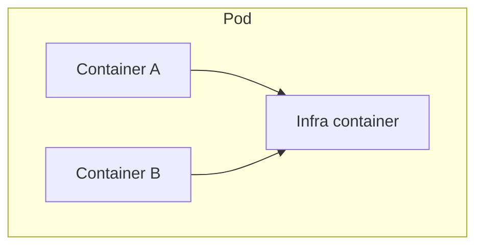

# Pod

## Pod的含义

Pod是kubernetes项目中最小的API对象，是kubernetes项目的原子调度单位。他是一组共享了某些资源的容器。
他代表的是容器设计模式。

## Pod实现原理

首先Pod只是一个逻辑概念。Kubernetes真正处理的是宿主机操作系统上容器的Namespace和Cgroups，而并不存在一个所谓的Pod的边界或者隔离环境。

Pod里所有的容器，共享的是同一个Network Namespace，并且可以声明共享同一个Volume。

在Kubernetes项目里，Pod的实现需要使用一个中间容器，这个容器叫做Infra容器，在这个Pod中，Infra容器永远都是第一个被创建的容器，而其他用户定义的容器，则通过Join Network Namespace的方式，与Infra容器关联在一起。



如上图所示，这个Pod里有两个用户容器A和B，还有一个Infra容器。很容易理解，在Kubernetes项目里，Infra容器一定要占用极少的资源，所以它使用的是一个非常特殊的镜像，叫作:k8s.gcr.io/pause。这个镜像是一个用汇编语言编写的、永远处于“暂停”状态的容器，解压后的大小也只有100~200KB左右。

而在Infra容器“Hold住”Network Namespace后，用户容器就可以加入到Infra容器的Network Namespace当中了。所以，如果你查看这些容器在宿主机上的Namespace文件(这个Namespace文件的路径，我已经在前面的内容中介绍过)，它们指向的值一定是完全一样的。

这也就意味着，对于Pod里的容器A和容器B来说:

- 它们可以直接使用localhost进行通信;
- 它们看到的网络设备跟Infra容器看到的完全一样;
- 一个Pod只有一个IP地址，也就是这个Pod的Network Namespace对应的IP地址;
- 当然，其他的所有网络资源，都是一个Pod一份，并且被该Pod中的所有容器共享;
- Pod的生命周期只跟Infra容器一致，而与容器A和B无关。

而对于同一个 Pod 里面的所有用户容器来说，它们的进出流量，也可以认为都是通过 Infra 容器完 成的。这一点很重要，因为将来如果你要为 Kubernetes 开发一个网络插件时，应该重点考虑的是 如何配置这个 Pod 的 Network Namespace，而不是每一个用户容器如何使用你的网络配置，这是没有意义的。
这就意味着，如果你的网络插件需要在容器里安装某些包或者配置才能完成的话，是不可取的: Infra 容器镜像的 rootfs 里几乎什么都没有，没有你随意发挥的空间。当然，这同时也意味着你的网 络插件完全不必关心用户容器的启动与否，而只需要关注如何配置 Pod，也就是 Infra 容器的 Network Namespace 即可。
有了这个设计之后，共享 Volume 就简单多了:Kubernetes 项目只要把所有 Volume 的定义都设计 在 Pod 层级即可。
这样，一个 Volume 对应的宿主机目录对于 Pod 来说就只有一个，Pod 里的容器只要声明挂载这个 Volume，就一定可以共享这个 Volume 对应的宿主机目录。比如下面这个例子:

```yml
apiVersion: v1
kind: Pod
metadata:
  name: two-containers
spec:
  restartPolicy: Never
  volumes:
  - name: shared-data
    hostPath:
      path: /data-tmp
  containers:
  - name: nginx-container
    image: nginx
    volumeMounts:
    - name: shared-data
      mountPath: /usr/share/nginx/html
  - name: debian-container
    image: debian
    volumeMounts:
    - name: shared-data
      mountPath: /pod-data
    command: ["/bin/sh"]
    args: ["-c", "echo Hello from the debian container > /pod-data/index.html"]
```

在这个例子中，debian-container和nginx-container都声明挂载了shared-data这个Volume。而shared-data是hostPath类型。所以，它对应在宿主机上的目录就是:/data。而这个目录，其实就被同时绑定挂载进了上述两个容器当中。

这就是为什么，nginx-container可以从它的/usr/share/nginx/html目录中，读取到debian-container生成的index.html文件的原因。

## 容器设计模式

Pod这种“超亲密关系”容器的设计思想，实际上就是希望，当用户想在一个容器里跑多个功能并不相关的应用时，应该优先考虑它们是不是更应该被描述成一个Pod里的多个容器。

**第一个最典型的例子是:WAR包与Web服务器。**

我们现在有一个JavaWeb应用的WAR包，它需要被放在Tomcat的webapps目录下运行起来。

假如，你现在只能用Docker来做这件事情，那该如何处理这个组合关系呢?

- 一种方法是，把WAR包直接放在Tomcat镜像的webapps目录下，做成一个新的镜像运行起来。可是，这时候，如果你要更新WAR包的内容，或者要升级Tomcat镜像，就要重新制作一个新的发布镜像，非常麻烦。
- 另一种方法是，你压根儿不管WAR包，永远只发布一个Tomcat容器。不过，这个容器的webapps目录，就必须声明一个hostPath类型的Volume，从而把宿主机上的WAR包挂载进Tomcat容器当中运行起来。不过，这样你就必须要解决一个问题，即:如何让每一台宿主机，都预先准备好这个存储有WAR包的目录呢?这样来看，你只能独立维护一套分布式存储系统了。

实际上，有了Pod之后，这样的问题就很容易解决了。我们可以把WAR包和Tomcat分别做成镜像，然后把它们作为一个Pod里的两个容器“组合”在一起。这个Pod的配置文件如下所示（Nginx示例）:

```yml
apiVersion: v1
kind: Pod
metadata:
  name: nginxweb
spec:
  initContainers:
  - image: dolphintwo/pod-sample:v2
    name: htmls
    command: ["cp", "/index.html", "/app"]
    volumeMounts:
    - mountPath: /app
      name: app-volume
  containers:
  - image: nginx:1.7.9
    name: nginx
    volumeMounts:
    - name: app-volume
      mountPath: /usr/share/nginx/html
  volumes:
  - name: app-volume
    emptyDir: {}
```

在这个Pod中，我们定义了两个容器，第一个容器使用的镜像是`dolphintwo/pod-sample:v2`，这个镜像里只有一个html(`index.html`)放在根目录下。而第二个容器则使用的是一个标准的Nginx镜像。

不过，你可能已经注意到，Html文件容器的类型不再是一个普通容器，而是一个InitContainer类型的容器。

在Pod中，所有`InitContainer`定义的容器，都会比`spec.containers`定义的用户容器先启动。并且，`InitContainer`容器会按顺序逐一启动，而直到它们都启动并且退出了，用户容器才会启动。

所以，这个`InitContainer`类型的Html文件容器启动后，我执行了一句`cp /index.html /app`，把应用的Html文件拷⻉到`/app`目录下，然后退出。
而后这个`/app`目录，就挂载了一个名叫`app-volume`的`Volume`。

接下来就很关键了。Nginx容器，同样声明了挂载`app-volume`到自己的html目录下。

所以，等Nginx容器启动时，它的html目录下就一定会存在html文件:这个文件正是Html文件容器启动时拷⻉到这个`Volume`里面的，而这个`Volume`是被这两个容器共享的。

像这样，我们就用一种“组合”方式，解决了Html包与网页容器之间耦合关系的问题。

实际上，这个所谓的“组合”操作，正是容器设计模式里最常用的一种模式，它的名字叫:`sidecar`。

顾名思义，`sidecar`指的就是我们可以在一个Pod中，启动一个辅助容器，来完成一些独立于主进程(主容器)之外的工作。

比如，在我们的这个应用Pod中，Nginx容器是我们要使用的主容器，而Html文件容器的存在，只是为了给它提供一个Html包而已。所以，我们用`InitContainer`的方式优先运行Html文件容器，扮演了一个`sidecar`的⻆色。

**第二个例子，则是容器的日志收集。**

比如，我现在有一个应用，需要不断地把日志文件输出到容器的`/var/log`目录中。这时，我就可以把一个Pod里的`Volume`挂载到应用容器的`/var/log`目录上。

然后，我在这个Pod里同时运行一个`sidecar`容器，它也声明挂载同一个`Volume`到自己的`/var/log`目录上。

这样，接下来`sidecar`容器就只需要做一件事儿，那就是不断地从自己的`/var/log`目录里读取日志文件，转发到`MongoDB`或者`Elasticsearch`中存储起来。这样，一个最基本的日志收集工作就完成了。

跟第一个例子一样，这个例子中的`sidecar`的主要工作也是使用共享的`Volume`来完成对文件的操作。

但不要忘记，Pod的另一个重要特性是，它的所有容器都共享同一个`Network Namespace`。这就使得很多与Pod网络相关的配置和管理，也都可以交给`sidecar`完成，而完全无须干涉用户容器。这里最典型的例子莫过于`Istio`这个微服务治理项目了，`Istio`项目使用`sidecar`容器完成微服务治理的原理。